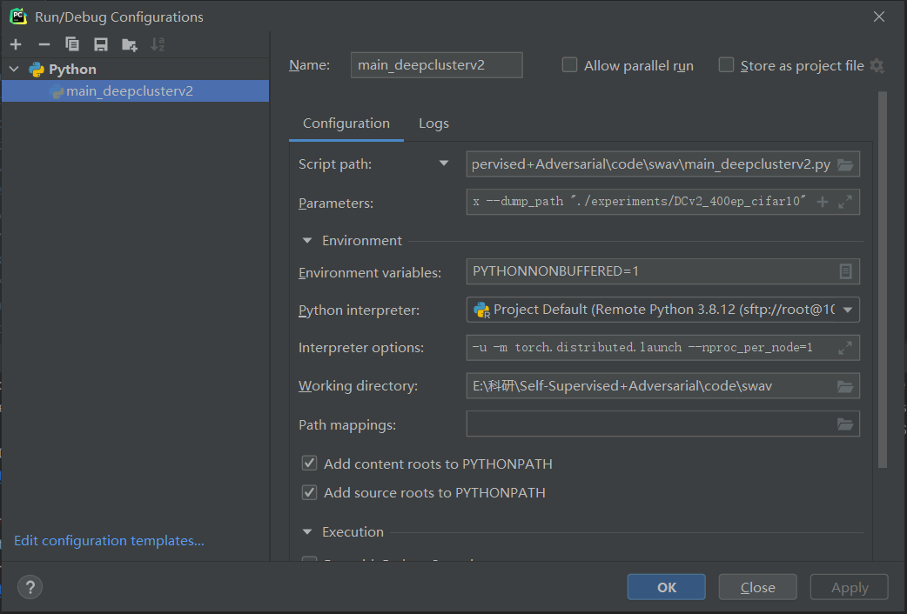
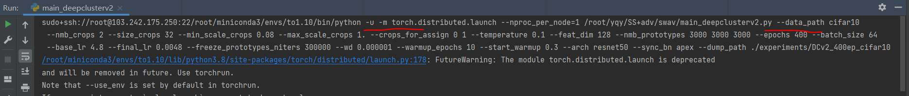
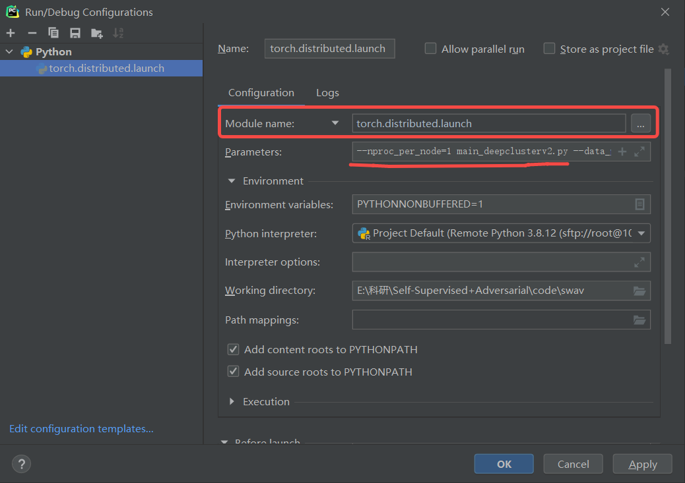

# ResearchUtils

Really not easy to search and look at my CSDN blogs. Directly use Github+.md to record my use of all kinds of utils.

* Linux
* apex
* pip / conda
* tmux
* pycharm

## Linux

du -h: 查看各文件夹大小

whereis / which 查看某命令的路径

**添加到环境变量`$PATH`：**
When we type a command, the shell searches through all directories specified in the user`$PATH` variable for an executable file of that name.

编辑`~/.bashrc`文件，在其中加入如下命令：

```sh
export PATH="$HOME/bin:$PATH"
```

Save the file and load the new `$PATH` into the current shell session using the `source` command:

```sh
source ~/.bashrc
```

**Install zsh:**

https://github.com/ohmyzsh/ohmyzsh

https://github.com/powerline/fonts

zsh bira配置：

先`conda config --set changeps1 False`取消掉默认环境显示

[修改 oh-my-zsh 主题使其正确显示 Conda 环境信息 - Glowming - 博客园 (cnblogs.com)](https://www.cnblogs.com/glowming/p/display-conda-env-name-in-zsh.html)


ssh:

免密登陆：`ssh-copy-id user@$HOST`，登录一次后以后再ssh就不用输入密码了

## apex

apex是一个非常好用的NVIDIA官方加速包：https://github.com/NVIDIA/apex

apex严格的需要两个cuda版本对应，否则会出问题：本机CUDA版本(编译apex的cuda版本)和编译Pytorch的cuda版本，我之前使用CUDA11.4和Pytorch1.9+cu111就不行，因为Pytorch1.9对应的CUDA11.1，和本机的CUDA11.4对不上。

对应不上的一个解决方法是把setup.py里面check版本对应的一行代码给注释掉（看装不上是setup.py文件的哪一行报错，我是159行的函数），这样就可以安装了，但后续使用可能会出问题。如果两个CUDA版本差别较小一般不会出问题。

终于他妈的把APEX搞好了！

## pip / conda

In order to initialize after the installation process is done, first run `source <path to conda>/bin/activate` and then run `conda init`.

### Conda 环境迁移：

Exporting the current environment to the `env.yml` file:

```
conda activate $env
conda env export > $env.yml
```

On the other system, create the environment from the `env.yml` file:

```shell
conda env create -f $env.yaml
```

The first line of the yml file sets the new environment's name.


离线环境迁移，不需要重装：

https://blog.csdn.net/weixin_40304882/article/details/116309131

### 恢复默认源: 

进入pip配置文件夹：`cd ~/.config/pip`

打开pip.conf，将里面的内容删掉或者用#注释掉

conda直接输入：`conda config --remove-key channels`


## Tmux

create/delete windows in a session:

* `Ctrl+b c`: create a new window
* `Ctrl+b n` — move to the (n)ext window.
* `Ctrl+b p` — move to the (p)revious window.
* `Ctrl+d` — delete the current window.

rename:

* session: `Ctrl + B, $`
* windows: `Ctrl + B, ,`

scroll screen:

`Ctrl`-`b` then `[` then you can use your normal navigation keys to scroll around (eg. `Up Arrow` or `PgDn`). Press `q` to quit scroll mode.

Tmux window keeps renaming: https://stackoverflow.com/questions/6041178/keep-the-windows-name-fixed-in-tmux

## Pycharm

### 建立SSH连接

https://www.jetbrains.com/help/pycharm/2021.1/create-ssh-configurations.html?keymap=primary_windows

自动上传：https://www.jetbrains.com/help/pycharm/2021.1/uploading-and-downloading-files.html#automaticUploadOnUpdate

在pycharm中给python解释器加可选项以及给.py脚本加参数：



效果如下：



### Debug distributed program:

https://intellij-support.jetbrains.com/hc/en-us/community/posts/360003879119-how-to-run-python-m-command-in-pycharm-

分布式训练出现错误：“RuntimeError: Address already in use”：加上`--master_port 29501`

命令行运行如下：`python -m torch.distributed.launch --nproc_per_node=1 main_swav.py --data_path cifar10 --nmb_crops 2`

在pycharm debug时，和普通debug不同，需要直接指定Module name，启动`torch.distributed.lauch`这个Module，其他的所有都放到Parameters里：



连接远程服务器Debug经常de不动，在Setting里把这个选上：


## LaTeX

`\left(` and `\right(` can make scale. 
$$
\left(1+\frac{1}{n}\right)^n
$$
$\to\infty \sqrt[n]{n!}$

\begin{enumerate}

\end{enumerate}

### More usage of LaTeX is recorded on AIR's private overleaf: https://103.242.175.166:9099, in "Hello LaTeX" project.

## Mac

我的 MacBook Pro 16 终于来了！即将陪我度过人生中最重要的五年，跟我一起并肩战斗，在此记录使用。

基于UNIX内核的系统yyds！命令行+简易图形化界面的操作逻辑yyds！

Homebrew安装: https://brew.sh/

brew安装wget: `brew install wget`

Powerline fonts installed to /Users/yuqiying/Library/Fonts
