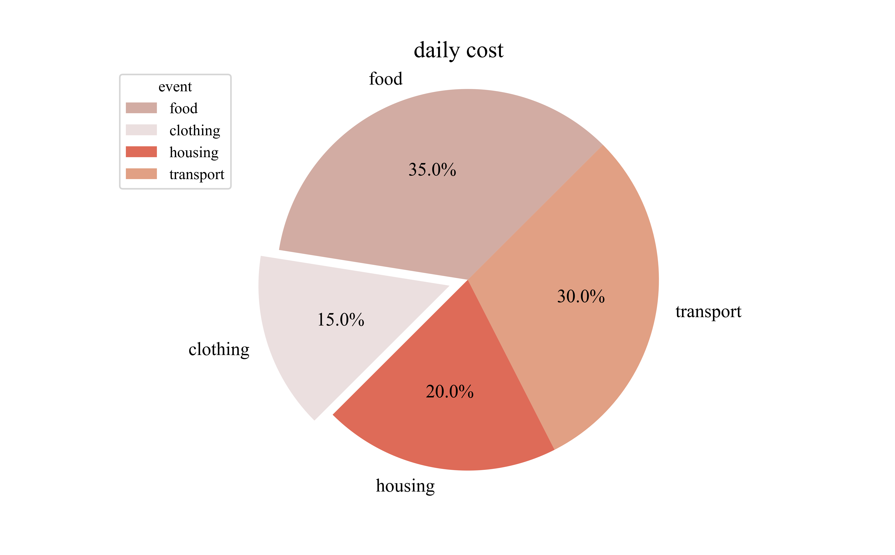

本文介绍一下怎么给图配上很好看的颜色。

首先我们需要通过百度找到一些颜色协调好看的配色卡，提供一个配色卡资源如下：

https://zhuanlan.zhihu.com/p/42878408

然后我们从中选择一个好看的色卡，比如选到了下面这张：

	

下面我们就要从中提取颜色了。为了让我们作的图用上这些颜色，我们需要知道这些颜色的RGB值，我的方法是使用windows系统自带的画图软件。我们先将配色卡导入，然后使用工具里面的颜色提取器，点击色卡上的颜色即完成提取：

	

然后点击颜色模块里面的“编辑颜色”：

	

即可查看到所选颜色对应的R、G、B的值：

	

下面我们通过这一个网站将其转换为十六进制颜色码：

https://www.sioe.cn/yingyong/yanse-rgb-16/

示例如下：

	

将获得的十六进制码写到程序中调整颜色的地方，即可完成配色。我用上面那张配色卡配的一张饼图如下，颜色还是十分协调美观的：

	

