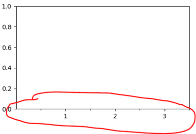
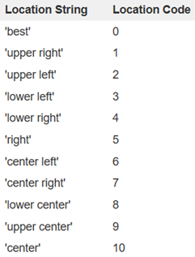

本篇文章是对matplotlib绘图的一些概念、一些通用性函数的综述。

对matplotlib的操作都是在一个figure上完成的，figure是一块画布，类似于现实中的画板。在一块画板上，可以绘制一幅或多幅图形，这些图形就是axes。当只有一个图形时，可以直接使用matplotlib.pyplot（简写为plt）来绘制。

首先我们要引入matplotlib，通用的简写如下：

```python
import matplotlib.pyplot as plt
```

画图的第一步通常是使用plt.subplots()函数：

生成一块画布。前两个参数为x、y，将画布分成x行y列，每一块是一个axe，返回画布和axes的数组，后面还可以跟一些figure的参数。示例：

```python
fig, axes = plt.subplots(1, 2, figsize = (8, 10))
```

之后调用各个axe的各个画图函数，即可对每一个小块进行作图。下介绍常用函数。

### 一、通用的一些参数

在调用函数对图形的文字、线条等进行操作时，有些参数是通用的。

* size：设置大小；

* color：设置颜色；

* width：线条、柱体等的宽度

### 二、常用函数

**文本设置：**

axes.set_xlabel()函数：设置x轴标签。其常用参数有fontdict，设置各个属性。

axes.set_ylabel()函数：设置y轴标签。

axes.set_title()函数：设置标题。

axes.text()函数：添加文本。一般前两个参数为文本的x、y坐标，第三个参数为文本内容。还有两个较常用的参数ha和va，他们都是设置坐标点相对于文本的位置，ha是水平位置，可选的值有'center'、'right'、'left'；va是竖直位置，可选的值有'center'、'top'、'bottom'。完整参数见：[https://matplotlib.org/api/_as_gen/matplotlib.pyplot.text.html?highlight=text#matplotlib.pyplot.text](https://matplotlib.org/api/_as_gen/matplotlib.pyplot.text.html?highlight=text%23matplotlib.pyplot.text)

**坐标轴、刻度设置：**

axes.set_xlim()函数：设置坐标范围。

axes.set_xticks()函数：设置坐标轴刻度。默认情况下是设置的主刻度，如果设置参数minor=True，那么就是设置的分刻度。示例：

```python
axes.set_xticks([1, 2, 3])
axes.set_xticks([0.5, 1.5, 2.5, 3.5], minor=True)
```

<p align="center">

</p>

axes.set_xticklabels()函数：设置主刻度的标签。

axes.Axis.set_minor_locator()函数：设置坐标轴最小刻度。参数是一个Locator类。示例如下：

```python
axes.yaxis.set_minor_locator(MultipleLocator(0.005))
```

**设置网格线：**

axes.grid()函数：画网格线。参数which：表示在哪个刻度画网格线，可选的有‘minor’、‘major’、‘both’。axis：表示在哪个轴画线，可选的有‘x’、‘y’、‘both’。示例：

```python
axe.grid(which = 'minor', c='lightgrey')
```

**图例设置：**

axes.legend()函数：设置图例。常用参数为loc，设置位置，可选值有：

<p align="center">

</p>

完整参数见：https://matplotlib.org/api/legend_api.html?highlight=legend#module-matplotlib.legend

plt.tight_layout()函数可以自动调整子图参数，填充整个图像区域。

### 三、设置字体

设置全局的字体：

```python
plt.rcParams["font.family"] = "Times New Roman"
```

设置局部的字体，常常改变需要设置的字体的fontdict参数中的family项，示例如下：

```python
plt.title("a", fontdict={'family': 'Times New Roman'})
```
