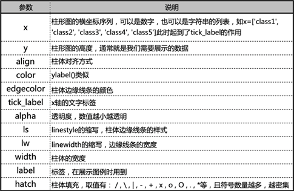

## 一、折线图

绘制折线图我们通常使用plot函数画曲线（折线）。每一个plot函数对应一条曲线，画多条线的时候调用多个plot函数即可。

**plot()函数：**

前两个参数为x、y。x：X轴数据，列表或数组；y：Y轴数据，列表或数组。后面还有很多的修饰曲线的参数，常用的有：color控制曲线颜色，linestyle（缩写ls）控制曲线的风格，marker控制数据点的风格等，其对应的常用字符在文章最后的附录。

示例：

代码及注释，其中除了plot之外的函数，在“matplotlib综述”一文中介绍：

```python
fig, axes = plt.subplots(1, 1, figsize=(8, 4))
# 折线图
axes.plot(x, y, linestyle='-', color='#DE6B58', marker='x', linewidth=1.5)
axes.plot(x, y2, linestyle='-', color='#E1A084', marker='x', linewidth=1.5)
# 设置最小刻度间隔
axes.yaxis.set_minor_locator(MultipleLocator(2.5))
axes.xaxis.set_minor_locator(MultipleLocator(0.5))
# 画网格线
axes.grid(which='minor', c='lightgrey')
# 设置x、y轴标签
axes.set_ylabel("Generation Consistency")
axes.set_xlabel("KB Row Number")
# 设置y轴的刻度
axes.set_yticks([70, 75, 80, 85, 90, 95])
# 对每个数据点加标注
for x_, y_ in zip(x, y):
    axes.text(x_, y_, y_, ha='left', va='bottom')
for x_, y_ in zip(x, y2):
    axes.text(x_, y_, y_, ha='left', va='bottom')
# 展示图片
plt.show()
```

效果如下：
<p align="center">

</p>

## 二、柱状图

### 1、普通柱状图

使用bar函数绘制柱状图，其常用参数如下：

<p align="center">

</p>

其中非常常用的是width、label、alpha、edgecolor、hatch。

此外，常用`axe.set_xticks`来设置刻度，使用`axe.set_xticklabels`来设置每个刻度上的标签。

`axes.spines['top'].set_visible(False)`可以用来设置边框不可见，可选的有top、right、bottom、left四条边。

示例：

代码及注释：

```python
fig, axes = plt.subplots(1, 1, figsize=(5, 3))
# 画柱状图
axes.bar(x, a1,  width=0.4, label='height', color="#D2ACA3")
# 图例
axes.legend(loc='best')
# 设置坐标轴刻度、标签
axes.set_xticks([0, 1, 2, 3, 4, 5])
axes.set_yticks([160, 165, 170, 175, 180, 185, 190])
axes.set_ylim((160, 190))
axes.set_xticklabels(['zhouyi', 'xuweijia', 'lurenchi', 'chenxiao', 'weiyu', 'guhaiyao'])
# 设置title
axes.set_title('NLP group members heights')
# 网格线
axes.grid(linewidth=0.5, which="major", axis='y')
# 隐藏上、右边框
axes.spines['top'].set_visible(False)
axes.spines['right'].set_visible(False)
```

效果：

<p align="center">

</p>

### 2、两对柱子竖直方向堆积

底下的柱体和普通柱状图画法一样。

画上面的柱子时，只需要再调用一个bar函数，这个bar函数要添加bottom参数，将bottom的值设置为底下柱子的数值即可。

示例：

```python
axes.bar(x, y1,  width=0.4, label='height', color='#D2ACA3')
axes.bar(x, y2, width=0.4, bottom=y1, color="#EBDFDF", label='increse')
```

<p align="center">

</p>

### 3、两对柱子并排排列

调用两次bar函数绘制两组柱体。让一组柱子的x值为x-width/2，另一组柱子的x值为x+width/2，即可实现两条柱子并排排列。示例：

```python
axes.bar(x - width / 2, a1,  width=width, label='2015', color="#D2ACA3")
axes.bar(x + width / 2, a2, width=width, label='2020', color="#EBDFDF")
```

<p align="center">

</p>

### 4、给每根柱体加标注

一般使用循环的形式加text，并将参数ha设置为center、va设置为bottom。示例：

```python
for i in range(6):
    axes.text(x[i], a1[i], a1[i], ha='center', va='bottom')
```

<p align="center">

</p>

## 三、饼状图

饼图使用`plt.pie`函数绘制，其各参数如下：

<p align="center">

</p>

其中labels、value、colors、explode是维数相同的列表。还有一些常用的参数：textprops可以设置所有文字（label和value）的属性、wedgeprops可以将饼状图设置为环状图。

pie()函数的返回值为饼片列表、文字标签列表、数值标签列表。可以先获得返回值，再通过setp()函数对相应的文字进行操作、调整。

此外，一般会使用plt.axis('equal')让饼状图看起来更圆。

示例：

代码及注释：

```python
fig, axe = plt.subplots(1, 1, figsize=(8, 5))

font1 = {'family': 'Times New Roman', 'size': '15'}
# 饼状图各个部分的标签、值、颜色
labels = ['food', 'clothing', 'housing', 'transport']
values = [0.35, 0.15, 0.2, 0.3]
colors = ['#D2ACA3', '#EBDFDF', '#DE6B58', '#E1A084']
# 突出显示
explode = [0, 0.1, 0, 0]
# 标题
axe.set_title("daily cost", fontdict=font1)
# 画饼状图
wedge, texts, pcts = axe.pie(values, labels=labels, colors=colors, startangle=45, autopct='%3.1f%%'
                             , explode=explode)
axe.axis('equal')
# 图例
axe.legend(wedge, labels, fontsize=10, title='event', loc=2)
# 设置文本的属性

plt.setp(texts, size=12)
plt.setp(pcts, size=12)
plt.show()
```

效果：

<p align="center">

</p>

如果给pie函数加上了wedgeprops参数，则可画出环形饼图，示例如下：

将上面的代码中的pie函数的参数增加`wedgeprops=dict(width=0.4)`：

<p align="center">

</p>

## 附录

color：

<p align="center">

</p>

marker：

<p align="center">

</p>

linestyle：

<p align="center">

</p>
