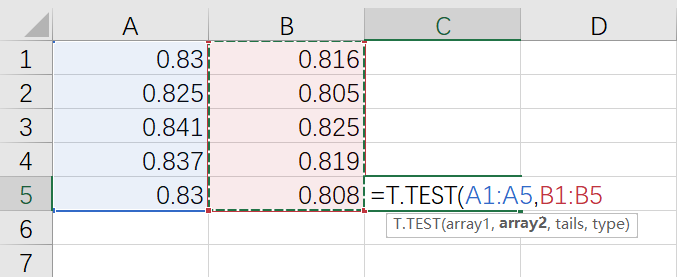

# T-test 用途
t-test主要用于样本含量较小（例如n < 30），总体标准差σ未知的正态分布。 t检验是用t分布理论来推论差异发生的概率，从而比较两个平均数的差异是否显著。
总之，它被用来比较两样本平均值之间是否具有显著性差异。

# T-test 分类
1.	单总体检验
2.	双总体检验

## 单总体检验
•单总体t检验是检验一个样本平均数与一个已知的总体平均数（通常来说是理论值）的差异是否显著。当总体分布是正态分布，如总体标准差未知且样本容量小于30，那么样本平均数与总体平均数的离差统计量呈t分布。
•单总体t检验统计量为：

	

## 双总体检验
双总体t检验是检验两个样本平均数与其各自所代表的总体的差异是否显著。双总体t检验又分为两种情况。
一是独立样本t检验（各实验处理组之间毫无相关存在，即为独立样本），该检验用于检验两组非相关样本被试所获得的数据的差异性；
二是配对样本t检验，检验的是成对的两个数值的差异是否不等于零，所谓成对的数值，一般是同一个被访者进行两项测试产生的两个值，例如试吃两种口味的蛋糕给出的两个评分。

•独立样本t检验统计量为：

	

•配对样本t检验统计量：

	

# T-test 操作过程
最简单也最实用的T-test方法是使用excel中自带的T-test函数进行检验，详细步骤如下：

1. 空白单元格中输入“=T.TEST”,双击T.TEST调起函数

	

2. 选择第一个数据集（数据范围）

	

3. 输入逗号隔开，再选择第二个数据集（数据范围）

	

4. 如果 tails = 1，则 T.TEST 使用单尾分布；如果 tails = 2，则 T.TEST 使用双尾分布。

	

双尾分布和单尾分布的区别方法

	

5. 再次输入逗号隔开，选择要执行的 t 检验的类型
type=1，成对样本
type=2，双样本等方差假设
type=3，双样本异方差假设

	

type值是由对数据得F检验结果得到的。F检验的执行方式可以参考[https://baike.baidu.com/item/F检验/9910842?fr=aladdin](https://baike.baidu.com/item/F检验/9910842?fr=aladdin)

6. 此时我们可以得到T-TEST的P值，如果P值小于0.05，则说明两组数据存在显著性差异。

	

