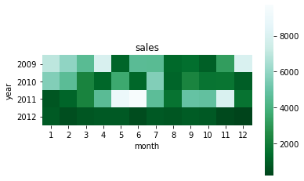

# 热力图介绍
热力图，也称为交叉填充表。一般用于展现两个离散变量之间的组合关系。
一般我们使用Seaborn中的heatmap函数来完成热力图的绘制。

# 热力图的性质与用途
1. 热力图是用于查看两个分类变量之间的强度分布。
2. 是由小色块组成的二维图表。
3.  X、Y轴各代表一种变量。
4. 每个坐标代表一个色块。
5. 每个色块代表一个数值。
6. 色块的颜色由数值的大小决定。
7. 一般数值从小到大，对应的颜色由浅变深。

# 热力图的绘制方法
在这里我们介绍的是使用Seaborn库中的heatmap函数绘制热力图的方法。
大致的绘制流程分为两步：第一步，对数据进行预处理；第二步，使用预处理的数据绘制热力图

## heatmap()函数的参数
官网给出的heatmap()函数如下：

```python
heatmap(data, vmin =None, vmax=None, cmap=None, center=None, annot=None, fmt=‘.2g’, annot_kws =None ,linewidths=0, linecolor =‘white’, cbar=True, cbar_kws=None, square=False, xticklabels='auto’，yticklabels='auto', mask=None, ax=None)
```

<p align="center">
	
</p>

<p align="center">
	
</p>

下面我们对常用的几个参数进行详细介绍：
cmap: 我们常常使用matplotlib中的色谱完成，参数后面加_r表示将颜色的顺序反过来。
annot(矩阵上数字), annot_kws(矩阵上数字的大小颜色字体) 【使用字典对字体格式进行设置】
fmt: 字符串格式代码，矩阵上标识数字的数据格式，比如保留小数点后几位数字 【如.2f表示小数点后保留两位小数】
mask用于突出显示某些数据，但本质上是将满足条件的值所对应的色块涂白，从而凸显不满足条件的数据。例如对表中小于100进行涂白，则代码如下:

```python
sns.heatmap(x, mask=x < 100)
```
## 数据预处理
在我们拥有一个存储数据的excel表格时，我们需要将excel表格中的数据转化成列联表格式。
以文件中的Sales1.xls为例，代码如下：

```python
IO = 'Sales1.xlsx'
sales = pd.read_excel(io = IO)

summary = pd.pivot_table(data = sales,
                         index = 'year',
                         columns = 'month',
                         values = 'sales')
```
注意：代码中引用的文件存储路径应与.py文件的存储路径相一致

下面我们对数据预处理部分涉及的函数与参数进行解释：

我们采取的是pandas中的pivot_table方法进行列联表设置，代码如下

```python
pd.pivot_table(data=None,values=None,index=None,columns=None,aggfunc='mean')
```
下面我们对涉及的参数进行解释
data：指定需要构造列联表的数据集
index：指定拉入行标签的字段
colums：指定拉入列标签的字段
values：指定拉入数值标签的字段列表
aggfunc：指定数值的统计函数，默认为统计均值，也可以指定为numpy模块中的其他统计函数

### 不存在特殊类型数据
在excel表格中不存在特殊类型数据时，我们可以直接将excel表格中的数据转化成列联表格式，即如上文所示。

### 存在date类型数据
对于excel表格中存在date类型数据的情况，我们需要对date类型数据进行预处理。以文件中的Sales2.xls为例，代码如下：

```python
IO = 'Sales2.xlsx'
sales = pd.read_excel(io = IO)

sales['year'] = sales['Date'].dt.year #提取年份
sales['month'] = sales['Date'].dt.month #提取月份

summary = pd.pivot_table(data = sales,
                         index = 'year',
                         columns = 'month',
                         values = 'Sales',
                         aggfunc = np.sum)
```
## 预处理完成后的绘制
在对excel中的数据进行预处理之后，我们就可以绘制热力图了。以文件中的Sales1.xls为例，代码如下：

```python
import pandas as pd
import matplotlib.pyplot as plt
import seaborn as sns
import numpy as np

IO = 'Sales1.xlsx'
sales = pd.read_excel(io = IO)

summary = pd.pivot_table(data = sales,
                         index = 'year',
                         columns = 'month',
                         values = 'sales')

sns.heatmap(data = summary,
            annot = False,
            square = True,
            cmap = 'BuGn_r')
plt.title('sales')
plt.show()
```
这时候，我们就可以得到数据集所对应的热力图了。

<p align="center">
	
</p>


